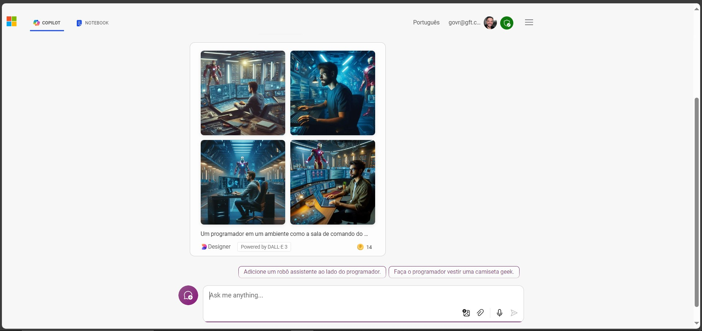

# GenAi Copilot Inputs e Outputs
Repositório com evidências do uso do Copilot para dar inputs via prompts e receber os putputs correspondentes.

## Passo a passo
Acessei o Microsoft Copilot e elaborei alguns prompots como esse:

Fiz o print e coloquei na pasta '**inputs**'.

Depois eu esperei a geração da resposta e coloquei o print na pasta '**outputs**'.

Essa interação com o Copilot me fez enxergar as vastas possibilidades de uso da AI.